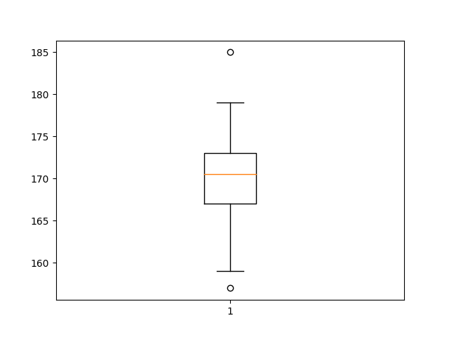
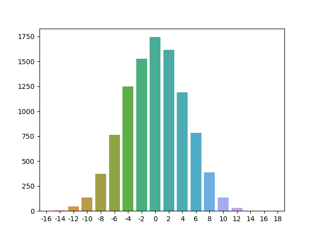

# Основы статистики

# Содержание
- [Основы статистики](#основы-статистики)
- [Содержание](#содержание)
- [1. Введение](#1-введение)
  - [1.1. Генеральная совокупность и выборка](#11-генеральная-совокупность-и-выборка)
  - [1.2. Типы переменных](#12-типы-переменных)
  - [1.3. Меры центральной тенденции](#13-меры-центральной-тенденции)
    - [1.3.1. Глоссарий](#131-глоссарий)
    - [1.3.2. Мода](#132-мода)
    - [1.3.3. Медиана](#133-медиана)
    - [1.3.4. Среднее арифметическое](#134-среднее-арифметическое)
    - [1.3.5. Свойства среднего значения](#135-свойства-среднего-значения)
  - [1.4. Меры изменчивости](#14-меры-изменчивости)
    - [1.4.1. Размах](#141-размах)
    - [1.4.2. Дисперсия](#142-дисперсия)
    - [1.4.3. Свойства дисперсии](#143-свойства-дисперсии)
  - [1.5. Квартили распределения и график box plot](#15-квартили-распределения-и-график-box-plot)
  - [1.6. Нормальное распределение](#16-нормальное-распределение)
  - [1.7. Центральная предельная теорема](#17-центральная-предельная-теорема)
  - [1.8. Доверительные интервалы для среднего](#18-доверительные-интервалы-для-среднего)
  - [1.9. Идея статистического вывода, p-уровень значимости](#19-идея-статистического-вывода-p-уровень-значимости)

# 1. Введение

## 1.1. Генеральная совокупность и выборка

**Генеральная совокупность** – совокупность всех объектов, относительно которых предполагается делать выводы при изучении конкретной задачи.

**Репрезентативная выборка** – такая выборка, в которой все основные признаки генеральной совокупности, из которой извлечена данная выборка, представлены приблизительно в той же пропорции или с той же частотой, с которой данный признак выступает в этой генеральной совокупности.

**Способы репрезентативной выборки:**
- Простая случайная выборка (Simple Random Sample - SRS);
- Стратифицированная выборка (Stratified sampling) – генеральная совокупность разбивается на несколько обособленных и различных по природе страт, затем используется SRS для каждой страты;
- Групповая выборка (или Кластерная выборка) (Cluster sampling) – генеральная совокупность делится на несколько групп или кластеров, все кластеры схожи между собой.

| Стратифицированная выборка                                                                   | Групповая (Кластерная) выборка                                                                   |
|----------------------------------------------------------------------------------------------|--------------------------------------------------------------------------------------------------|
| Выборка формируется из всех субпопуляций (страт)                                             | Выборка формируется только из нескольких субпопуляций (кластеров)                                |
| В пределах страты элементы должны быть однородны, а между стратами должна быть разнородность | В пределах кластера элементы должны быть разнородны, а между кластерами должна быть однородность |
| Должна быть сформирована полная схема выборки для всех стратифицированных субпопуляций       | Должна быть сформирована схема выборки только для кластеров, попавших в выборку                  |
| Повышает точность                                                                            | Повышает эффективность выборки, уменьшая стоимость                                               |

## 1.2. Типы переменных

- **Количественные:**
    - **Непрерывные** – переменная, принимающая значение из некоторого промежутка (например рост);
    - **Дискретные** – переменная, принимающая значение из определенного списка чисел (например количество детей);
- **Качественные:**
    - **Номинальные** – перменная, используемая для разделения всех объектов выборки на определенные группы. Используются как имена групп (например 1-женщины, 2-мужчины);
    - **Ранговые** – перменная, которая позволяет ранжировать объекты выборки. Возможны только сравнения (например результаты забега, т.е. бегун с рангом 1 быстрее бегуна с рангом 5, но мы не можем сказать ни во сколько, ни на сколько выражено его преимущество).

## 1.3. Меры центральной тенденции

### 1.3.1. Глоссарий

**Эмпирические данные** – данные полученные опытным путём.

**Описательная (дескриптивная) статистика** – обработка данных полученных эмпирическим путём и их систематизация, наглядное представление в форме графиков, таблиц, а также их количественное описание посредством основных статистических показателей.

**Распределение вероятностей** – это закон, описывающий область значений случайной величины и вероятность её появления (частоту) в данной области. То есть насколько часто $X$ появляется в данном диапазоне значений.

**Гистограмма частот** – ступенчатая функция показывающая насколько часто вероятно появление величины в указанном диапазоне значений.

### 1.3.2. Мода

**Мода** (Mode) – значение измеряемого признака, которое встречается максиматьно часто. В выборке может быть одна или несколько мод.

```python
import numpy as np
from scipy import stats

sample = np.array([185, 175, 170, 169, 171, 172, 175, 157, 170, 172, 167, 173, 168, 167, 166, 167, 169, 172, 177, 178, 165, 161, 179, 159, 164, 178, 172, 170, 173, 171])
print(f"mode: {stats.mode(sample, keepdims=True)}")
```
```
mode: ModeResult(mode=array([172]), count=array([4]))
```

### 1.3.3. Медиана

**Медиана** (Median) – значение измеряемого признака, которое делит упорядоченное множество пополам. Если множество содержит нечетное четное число элементов, то

$$ \mathrm{median}(x) = x_{(n+1)/2} $$

если же множество содержит четное четное число элементов, то

$$ \mathrm{median}(x) = \frac{x_{(n/2)} + x_{((n/2)+1)}}{2} $$

```python
import numpy as np

sample = np.array([185, 175, 170, 169, 171, 172, 175, 157, 170, 172, 167, 173, 168, 167, 166, 167, 169, 172, 177, 178, 165, 161, 179, 159, 164, 178, 172, 170, 173, 171])
print(f"median: {np.median(sample)}")
```
```
median: 170.5
```

### 1.3.4. Среднее арифметическое

**Среднее арифметическое** (Mean) – значение измеряемого признака, равное сумме всех значений измеряемого признака, деленной на количество измеряемых значений.

$$ \overline{x}=\frac{1}{n}(\sum_{i=1}^{n}{x_{i}})=\frac{x_{1}+x_{2}+\cdots+x_{n}}{n}  $$

```python
import numpy as np

sample = np.array([185, 175, 170, 169, 171, 172, 175, 157, 170, 172, 167, 173, 168, 167, 166, 167, 169, 172, 177, 178, 165, 161, 179, 159, 164, 178, 172, 170, 173, 171])
print(f"mean: {np.mean(sample)}")
```
```
mean: 170.4
```

### 1.3.5. Свойства среднего значения

$$ M_{x+c}=\frac{\sum_{i=1}^{n}{(x_{i}+c)}}{n}=\frac{\sum_{i=1}^{n}{x_{i}}}{n}+\frac{\sum_{i=1}^{n}{c}}{n}=M_{x}+\frac{nc}{c}=M_{x}+c  $$

$$ M_{x\cdot c}=\frac{\sum_{i=1}^{n}{(x_{i}\cdot c)}}{n}=\frac{c\cdot \sum_{i=1}^{n}{x_{i}}}{n}=c\cdot M_{x} $$

$$ \sum_{i=1}^{n}{(x_{i}-M_{x})}=nM_{x}-nM_{x}=0 $$

## 1.4. Меры изменчивости

### 1.4.1. Размах

**Размах** (Range) – разность между максимальным и минимальным значением выборки. Крайняя чувствительность к выбросам.

$$ R=\mathrm{max}(X)-\mathrm{min}(X) $$

```python
import numpy as np

sample = np.array([185, 175, 170, 169, 171, 172, 175, 157, 170, 172, 167, 173, 168, 167, 166, 167, 169, 172, 177, 178, 165, 161, 179, 159, 164, 178, 172, 170, 173, 171])
# ptp stands for "peak to peak"
print(f"range: {np.ptp(sample)}")
```
```
range: 28
```

### 1.4.2. Дисперсия

**Дисперсия** (Variance) – средний квадрат отклонений индивидуальных значений признака от их средней велечины.

**Для генеральной совокупности**

$$ D = \frac{\sum_{i=1}^{n}{({x_{i}-M_{x}})^{2}}}{n} $$

Среднеквадратичное отклонение

$$ \sigma=\sqrt{D} $$

**Для выборки**

$$ D = \frac{\sum_{i=1}^{n}{({x_{i}-M_{x}})^{2}}}{n-1} $$

где 1 – это количество степеней свободы.

Важно отметить, что среднеквадратичное отклонение для выборки обозначают **sd** (standart deviation).

$$ \mathrm{sd}=\sqrt{D} $$

```python
import numpy as np

sample = np.array([185, 175, 170, 169, 171, 172, 175, 157, 170, 172, 167, 173, 168, 167, 166, 167, 169, 172, 177, 178, 165, 161, 179, 159, 164, 178, 172, 170, 173, 171])
# ddof - Delta Degrees of Freedom
print(f"std: {np.std(sample, ddof=1)}")
```
```
std: 6.0034472855472645
```

### 1.4.3. Свойства дисперсии

$$ D_{x+c}=D_{x} $$

$$ \mathrm{sd}_{x+c}=\mathrm{sd}_{x} $$

$$ D_{x\cdot c}=D_{x}\cdot c^{2} $$

$$ \mathrm{sd}_{x\cdot c}=\mathrm{sd}_{x}\cdot c $$

## 1.5. Квартили распределения и график box plot

**Квантиль** – это значение, ниже которого лежит определённое число наблюдений, соответствующих выбранной частоте.

**Квартиль распределения** — это квантили, кратные 25%, то есть соответствующие 25%, 50% и 75%. Их ещё иногда называют соответственно "первый", "второй" и "третий" либо "нижний", "средний" и "верхний".

**Box plot** – вид диаграммы, показывающий в удобной форме медиану, нижний и верхний квартили, минимальное и максимальное значение выборки, выборсы.


Квартили и inter quartule range (IQR) используют, чтобы оценить наличие выборосов. Алгоритм расчета – посчитали квартили, посчитали разницу между ними, вычислили теоретический максимум и минимум, сравнили с имеющимися и выяснили есть ли у нас выборосы и сколько их.

```python
import numpy as np
import matplotlib.pyplot as plt

sample = np.array([185, 175, 170, 169, 171, 172, 175, 157, 170, 172, 167, 173, 168, 167, 166, 167, 169, 172, 177, 178, 165, 161, 179, 159, 164, 178, 172, 170, 173, 171])
plt.boxplot(sample)
plt.show()
```


## 1.6. Нормальное распределение

**Кратко**

- Унимодально
- Симметрично
- Отклонения наблюдений от среднего подчиняются определенному вероятностному закону

**Подробно**

Нормальное распределение возникает в результате воздействия множества факторов, вклад каждого из которых очень мал.

Для облегчения этого восприятия в 1873 году Фрэнсис Гальтон сделал устройство, которое в последствии назвали Доской Галтона (или квинкункс). Суть простая: сверху по середине подаются шарики, которые при прохождении нескольких уровней (например, 10-ти) на каждом уровне сталкиваются с препятствием, и при каждом столкновении отскакивают либо влево, либо вправо (с равной вероятностью).

Результат прохождения – распределение, стремящееся к нормальному.

```python
import numpy as np
import matplotlib.pyplot as plt
import seaborn as sns
data = dict()
# количество шариков
N = 10000
# количество уровней
level = 20
for _ in range(N):
    index = 0
    for _ in range(level):
        index += np.random.choice([-1, 1])
    data.setdefault(index, 0)
    data[index] += 1
sns.barplot(x=list(data.keys()), y=list(data.values()))
plt.show()
```



## 1.7. Центральная предельная теорема

## 1.8. Доверительные интервалы для среднего

## 1.9. Идея статистического вывода, p-уровень значимости